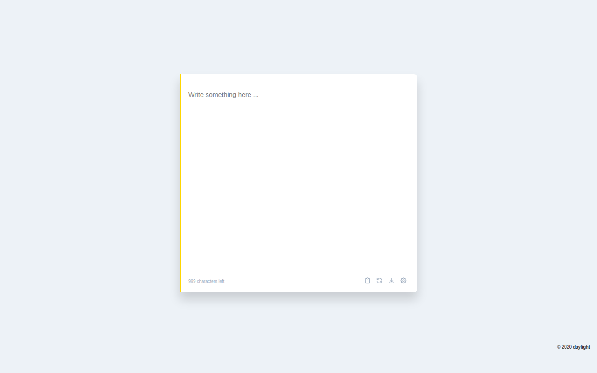

# daylight

Daylight, stylized as `daylight`, is a Google Chrome browser extension that let's you write down notes directly on the new tab page.

## Features

- Opt in to automatically reset your notes from your template (resets at midnight)
- Easily copy your notes for the day with a copy to clipboard button and send it anywhere
- Download current notes as text file
- Dark mode? Oh You're darn right

## Add to Chrome

### Official release

Get `daylight` officially on [Chrome Web Store](https://chrome.google.com/webstore/detail/daylight/acfblhlodbfnocogojghkgnpoellplll).

### Developer mode

You may download a version of this extension on the [releases](https://github.com/earvinpiamonte/daylight/releases) page.

1. Download any released version.
2. Extract files to a directory.
3. Open Google Chrome and type `chrome://extensions` on the address bar and press enter.
4. On the top right side of the Extensions page, enable `Developer mode`.
5. Click on `Load unpacked` button and select `daylight/` directory from the extracted release.
6. Open a new tab and enjoy!

## Maintainer

This project is developed and maintained by [@earvinpiamonte](https://twitter.com/earvinpiamonte).

## Credits

Icons made by [Freepik](https://www.flaticon.com/authors/freepik) from [www.flaticon.com](https://www.flaticon.com/).

SVG icons by [Heroicons](https://heroicons.dev/).

 
 
 
 
"It might be nice for people to hear a song about daylight, especially when we don’t get as much of it as we used to." - Joji
